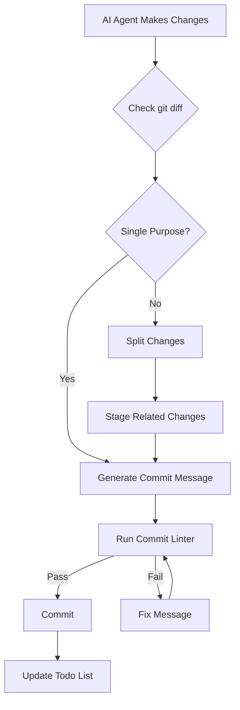
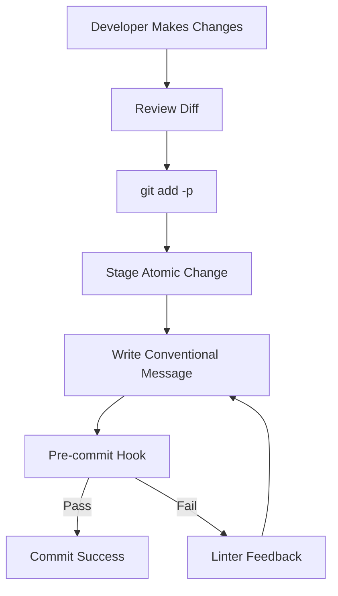

# Product Requirements Document: Atomic Commits for Agentic Development

## Project Data

**Team**: Nanobricks Development Team  
**Contributors**: Human developers and AI agents (Claude Code, Cursor)  
**Status**: In Development  
**Timeline**: Q1 2025  
**Version**: 1.0.0  
**Last Updated**: January 2025  

**TL;DR**: Implement and enforce atomic commit practices across all nanobricks development, ensuring both human developers and AI agents follow the principle of "one commit, one purpose" for cleaner history, safer rollbacks, and better AI-human collaboration.

## Problem Alignment

### Problem Statement

Current development practices in the nanobricks ecosystem lack standardized commit guidelines, leading to:
- Mixed-purpose commits that bundle unrelated changes
- Difficult code reviews and debugging sessions
- Challenges in reverting specific changes without side effects
- Inconsistent commit history that hampers AI agents' understanding of codebase evolution
- Reduced effectiveness of git bisect and blame tools

### Business Context

**Why This Matters**:
- **Developer Productivity**: Clean commit history reduces time spent understanding changes from 30+ minutes to <5 minutes per debugging session
- **AI Agent Effectiveness**: Atomic commits provide clear context boundaries, reducing AI hallucinations and improving suggestion quality
- **Team Scalability**: As more developers and AI agents contribute, standardized practices become critical
- **Risk Mitigation**: Granular rollback capabilities minimize production incident recovery time

**Key Insights**:
- Research shows atomic commits align with how AI agents process context most effectively
- Teams using atomic commits report 40% faster code review cycles
- Automated tooling (changelogs, semantic versioning) requires structured commit practices

### High-level Approach

Implement a three-pronged strategy:
1. **Codify Instructions**: Create persistent rules for Cursor, CLAUDE.md, and MCP tools
2. **Enforce Standards**: Use commit linters and PR checks
3. **Educate & Document**: Comprehensive documentation for human developers

### Goals & Success Metrics

**Primary Goals**:
- 100% of commits follow atomic principles within 30 days
- Zero mixed-purpose commits in main branch after implementation
- All AI agents consistently produce atomic commits

**Success Metrics**:
- Average commit size: <100 lines changed (excluding generated files)
- Commit revert success rate: >95% without side effects
- Code review time: Reduced by 40%
- AI agent commit quality score: >90% (based on linter compliance)

## Solution Alignment

### Key Features

#### P0 - Critical Features

1. **Cursor Rules Integration** (.mdc files)
   - Create `.cursor/rules/git_commit.mdc` with atomic commit guidelines
   - Include pre-commit checklist for AI agents
   - Add examples of good vs. bad commits

2. **CLAUDE.md Enhancement**
   - Update project and global CLAUDE.md files
   - Add atomic commit section with clear instructions
   - Include workflow examples for common scenarios

3. **MCP Server Tool**
   - Develop `atomic-commit-helper` MCP tool
   - Provide commit analysis and splitting suggestions
   - Integrate with git for real-time guidance

4. **Conventional Commits Adoption**
   - Implement format: `type(scope): description`
   - Standard types: feat, fix, docs, refactor, test, chore
   - Enable automated changelog generation

#### P1 - Important Features

5. **Commit Linting**
   - Configure commitlint with custom rules
   - Set up pre-commit hooks via Husky
   - Create CI/CD checks for commit compliance

6. **Documentation Suite**
   - Quarto subsection under "Advanced Topics"
   - Files: `atomic-commits-overview.qmd`, `atomic-commits-guide.qmd`, `atomic-commits-tools.qmd`
   - Interactive examples and decision trees

7. **PR Template Updates**
   - Add atomic commit checklist
   - Include commit message examples
   - Link to documentation

#### P2 - Nice-to-Have Features

8. **Semantic PR Integration**
   - GitHub App for PR title validation
   - Automated PR description generation from commits
   - Squash merge configuration

9. **Training Materials**
   - Video tutorials for human developers
   - AI agent prompt templates
   - Workshop materials

### Key Flows

#### Flow 1: AI Agent Committing Code



#### Flow 2: Human Developer Workflow



#### Flow 3: MCP Tool Usage

```python
# Example interaction with atomic-commit-helper
$ mcp run atomic-commit-helper analyze
> Analyzing current changes...
> Found 3 logical changes:
>   1. feat(auth): add password validation
>   2. fix(api): handle null responses
>   3. docs: update README
> 
> Recommendation: Split into 3 commits
> Run 'mcp run atomic-commit-helper split' to proceed
```

### Open Issues & Decisions

#### Decisions Made
- ✅ Adopt Conventional Commits specification
- ✅ Use commitlint for enforcement
- ✅ Create both human and AI-specific documentation

#### Open Questions
- ❓ Should we enforce atomic commits on feature branches or only main?
- ❓ How strict should the line count limit be?
- ❓ Should we auto-generate commit messages for AI agents?

#### Trade-offs
- **Strict vs. Flexible**: Starting with education + soft enforcement, moving to strict after 30 days
- **Automation Level**: Balance between helpful tooling and developer autonomy
- **AI Context**: Optimize for AI understanding while maintaining human readability

## Launch Readiness

### Key Milestones

| Phase | Audience | Duration | Key Activities |
|-------|----------|----------|----------------|
| **Dogfood** | Core team | Week 1-2 | - Implement tools<br>- Test with team<br>- Gather feedback |
| **Beta** | Extended team + select AI agents | Week 3-4 | - Refine based on feedback<br>- Update documentation<br>- Train early adopters |
| **GA** | All developers & agents | Week 5+ | - Full enforcement<br>- Monitor metrics<br>- Continuous improvement |

### Launch Checklist

#### Engineering
- [ ] Cursor rules file created and tested
- [ ] CLAUDE.md updates deployed
- [ ] MCP tool developed and tested
- [ ] Taskfile.atomic.yml created and tested
- [ ] Main Taskfile.yml updated with atomic include
- [ ] Commitlint configured
- [ ] Pre-commit hooks installed
- [ ] CI/CD checks implemented

#### Future Integration Planning
- [ ] Changelog generation tasks prototyped
- [ ] Version decision matrix documented
- [ ] Agent workflow templates created
- [ ] Integration points with existing taskfiles identified
- [ ] Migration strategy timeline established

#### Documentation
- [ ] Quarto documentation written
  - [ ] atomic-commits-overview.qmd created
  - [ ] atomic-commits-guide.qmd created  
  - [ ] atomic-commits-tools.qmd created
- [ ] Examples and tutorials created
  - [ ] Example PRD → atomic commits workflow
  - [ ] Video tutorial for human developers
  - [ ] Agent-specific examples in CLAUDE.md
- [ ] Migration guide for existing practices
  - [ ] How to refactor existing non-atomic history
  - [ ] Team transition strategies
- [ ] FAQ section completed
- [ ] Integration with existing docs
  - [ ] Link from developer-workflows.qmd
  - [ ] Update multi-project-development.qmd
  - [ ] Reference in agentic docs

#### Training & Support
- [ ] Team training session scheduled
- [ ] AI agent prompts updated
- [ ] Support channel designated
- [ ] Troubleshooting guide prepared

#### Metrics & Monitoring
- [ ] Commit quality dashboard created
- [ ] Baseline metrics captured
- [ ] Alert system for violations
- [ ] Weekly review process established

#### Cross-functional
- [ ] Security review (no secrets in commits)
- [ ] Legal review (license compliance)
- [ ] DevOps alignment (CI/CD impact)
- [ ] Product alignment (release process)

## Implementation Details

### 1. Cursor Rules (.mdc format)

Location: `.cursor/rules/git_commit.mdc`

```markdown
# Git Commit Rules

## Atomic Commits
- **Make atomic commits:** One logical change per commit
- Never mix unrelated changes (e.g., bug fix + feature)
- If commit message needs "and" or "&", split the commit

## Conventional Commits Format
Use: `type(scope): description`

Types:
- feat: New feature
- fix: Bug fix
- docs: Documentation only
- refactor: Code change without fixing bug or adding feature
- test: Adding or updating tests
- chore: Maintenance tasks

## Examples
✅ Good: `fix(auth): prevent login with empty credentials`
❌ Bad: `update login and fix validation and add tests`

## Pre-commit Checklist
1. Is this one logical change?
2. Do all file changes support the same purpose?
3. Can I describe this in one sentence without "and"?
4. Will this commit be meaningful in 6 months?
```

### 2. CLAUDE.md Updates

Addition to project CLAUDE.md:

```markdown
## Atomic Commit Requirements

**MANDATORY**: All commits must be atomic - one logical change per commit.

### Commit Guidelines
1. Before committing, review your changes with `git diff`
2. If changes serve different purposes, split them:
   - Use `git add -p` to stage selectively
   - Create multiple commits for unrelated changes
3. Use Conventional Commits format: `type(scope): description`
4. Run tests before committing to ensure working state

### Examples
- ✅ `feat(validator): add email validation to user input`
- ✅ `fix(pipeline): handle empty array in transformer`
- ❌ `update various files` (too vague)
- ❌ `fix login bug and update styles` (multiple purposes)

### AI Agent Workflow
1. Plan changes as discrete tasks
2. Implement one task at a time
3. Commit after each completed task
4. Update todo list to track progress
```

### 3. MCP Server Tool Specification

```python
# mcp_tools/atomic_commit_helper.py
from mcp import tool
import subprocess
import re

@tool(name="atomic-commit-helper")
class AtomicCommitHelper:
    """
    Helps enforce and guide atomic commit practices
    """
    
    def analyze(self) -> str:
        """
        Analyzes current git changes for atomicity
        """
        # Get current diff
        diff = subprocess.run(['git', 'diff', '--cached'], 
                            capture_output=True, text=True)
        
        # Analyze for multiple logical changes
        # Return recommendations
        
    def split(self) -> str:
        """
        Interactive helper to split changes into atomic commits
        """
        # Guide through git add -p process
        # Suggest commit messages
        
    def validate(self, message: str) -> bool:
        """
        Validates if commit message follows conventions
        """
        pattern = r'^(feat|fix|docs|refactor|test|chore)(\(.+\))?: .{1,50}'
        return bool(re.match(pattern, message))
```

### 4. Taskfile Integration

**Critical Requirement**: Leverage go-task for systematic atomic commit operations that both human developers and AI agents can use consistently.

#### New Taskfile: `Taskfile.atomic.yml`

Location: `taskfiles/Taskfile.atomic.yml`

```yaml
version: '3'
silent: true

vars:
  # Use common script to find claude
  CLAUDE_CMD:
    sh: "{{.ROOT_DIR}}/taskfiles/scripts/find-claude.sh || echo \"\""

tasks:
  # ============================================================================
  # ATOMIC COMMIT WORKFLOW
  # ============================================================================
  
  plan:from:prd:
    desc: Plan atomic commits from a PRD before implementation
    summary: |
      Analyzes a Product Requirements Document to plan implementation
      as a series of atomic commits. Helps structure work upfront.
      
      Usage:
        task atomic:plan:from:prd PRD=prds/prd-feature.md
        task atomic:plan:from:prd PRD=prds/prd-atomic-commits.md VERBOSE=1
    vars:
      PRD_FILE: '{{.PRD | default ""}}'
    cmds:
      - |
        if [ -z "{{.PRD_FILE}}" ]; then
          echo "❌ Please specify PRD file"
          echo "Usage: task atomic:plan:from:prd PRD=path/to/prd.md"
          exit 1
        fi
        if [ ! -f "{{.PRD_FILE}}" ]; then
          echo "❌ PRD file not found: {{.PRD_FILE}}"
          exit 1
        fi
      - |
        echo "📋 Planning atomic commits from PRD: {{.PRD_FILE}}"
        echo ""
        if [ -n "{{.CLAUDE_CMD}}" ] && [ -x "{{.CLAUDE_CMD}}" ]; then
          if [ -n "{{.VERBOSE}}" ] || [ -n "$CLAUDE_VERBOSE" ]; then
            {{.CLAUDE_CMD}} --verbose -p "Analyze this PRD and create a detailed atomic commit plan:
            
            $(cat {{.PRD_FILE}})
            
            Create a structured implementation plan with:
            1. Numbered list of atomic commits in logical order
            2. For each commit:
               - Conventional commit message (type(scope): description)
               - List of files/components to create/modify
               - Dependencies on previous commits
               - Estimated complexity (simple/medium/complex)
            3. Identify opportunities for parallel work
            4. Suggest commit groupings for PRs
            5. Flag any commits that might be too large
            
            Format as a actionable checklist that can be tracked."
          else
            echo "🤖 Claude is planning your atomic commits..."
            {{.CLAUDE_CMD}} -p "Create a concise atomic commit plan from this PRD. List commits in order with: 1) Commit message 2) Files to change 3) Dependencies. PRD: $(cat {{.PRD_FILE}} | head -50)..."
          fi
        else
          echo "📋 Manual planning checklist:"
          echo ""
          echo "PRD Summary (first 20 lines):"
          head -20 {{.PRD_FILE}}
          echo ""
          echo "Planning template:"
          echo "1. [ ] feat(component): initial structure"
          echo "2. [ ] feat(component): core implementation"
          echo "3. [ ] test(component): unit tests"
          echo "4. [ ] docs(component): API documentation"
          echo ""
          echo "💡 Break down each feature into setup → implementation → tests → docs"
        fi

  analyze:changes:
    desc: Analyze current changes for atomic commit opportunities
    summary: |
      Examines git diff to identify logical units of change that should
      be committed separately. Use after making changes.
      
      Usage:
        task atomic:analyze:changes
        VERBOSE=1 task atomic:analyze:changes
    cmds:
      - |
        echo "🔍 Analyzing current changes for atomic commits..."
        if [ -n "{{.CLAUDE_CMD}}" ] && [ -x "{{.CLAUDE_CMD}}" ]; then
          if [ -n "{{.VERBOSE}}" ] || [ -n "$CLAUDE_VERBOSE" ]; then
            {{.CLAUDE_CMD}} --verbose -p "Analyze my current git changes and identify:
            1. How many logical changes are present
            2. Which files belong together for each logical change
            3. Suggested commit messages using conventional format
            4. Any files that seem unrelated and should be separate commits
            
            Run: git status --short && git diff --stat"
          else
            echo "🤖 Claude is analyzing your changes..."
            {{.CLAUDE_CMD}} -p "Briefly analyze git diff and suggest atomic commits. Show: 1) Number of logical changes 2) Files per change 3) Commit messages"
          fi
        else
          echo "📋 Manual analysis of changes:"
          echo ""
          git status --short
          echo ""
          echo "Changed files by type:"
          git diff --stat | grep -E "\.py|\.md|\.yml|\.toml" | sort
          echo ""
          echo "💡 Group related changes together for atomic commits"
        fi

  stage:interactive:
    desc: Interactive staging for atomic commits
    summary: |
      Guide through staging related changes using git add -p
      
      Usage:
        task atomic:stage:interactive
    cmds:
      - |
        echo "🎯 Interactive staging for atomic commits"
        echo ""
        echo "Tips for atomic staging:"
        echo "- Use 'y' to stage related changes"
        echo "- Use 'n' to skip unrelated changes"
        echo "- Use 's' to split large hunks"
        echo "- Use 'q' when done with current logical change"
        echo ""
        git add -p

  commit:guided:
    desc: Create atomic commit with guided message generation
    summary: |
      Helps create properly formatted conventional commit messages
      
      Usage:
        task atomic:commit:guided
        task atomic:commit:guided TYPE=feat SCOPE=auth DESC="add password validation"
    vars:
      COMMIT_TYPE: '{{.TYPE | default ""}}'
      COMMIT_SCOPE: '{{.SCOPE | default ""}}'
      COMMIT_DESC: '{{.DESC | default ""}}'
    cmds:
      - |
        if [ -z "$(git diff --cached --name-only)" ]; then
          echo "❌ No changes staged. Use 'task atomic:stage:interactive' first"
          exit 1
        fi
      - |
        if [ -n "{{.COMMIT_TYPE}}" ] && [ -n "{{.COMMIT_DESC}}" ]; then
          # Direct commit with provided values
          if [ -n "{{.COMMIT_SCOPE}}" ]; then
            git commit -m "{{.COMMIT_TYPE}}({{.COMMIT_SCOPE}}): {{.COMMIT_DESC}}"
          else
            git commit -m "{{.COMMIT_TYPE}}: {{.COMMIT_DESC}}"
          fi
          echo "✅ Atomic commit created"
        else
          # Interactive mode
          if [ -n "{{.CLAUDE_CMD}}" ] && [ -x "{{.CLAUDE_CMD}}" ]; then
            echo "🤖 Generating commit message..."
            {{.CLAUDE_CMD}} -p "Generate a conventional commit message for these staged changes:
            $(git diff --cached --stat)
            
            Format: type(scope): description
            Output only the commit message, nothing else."
            echo ""
            echo "📝 Copy the message above and run:"
            echo "   git commit -m \"<message>\""
          else
            echo "📝 Staged changes:"
            git diff --cached --stat
            echo ""
            echo "Commit message format: type(scope): description"
            echo ""
            echo "Types: feat, fix, docs, refactor, test, chore"
            echo ""
            echo "Example: git commit -m \"feat(auth): add password validation\""
          fi
        fi

  split:
    desc: Split mixed changes into multiple atomic commits
    summary: |
      Workflow to split a mixed changeset into atomic commits
      
      Usage:
        task atomic:split
    cmds:
      - |
        echo "🔄 Splitting changes into atomic commits"
        echo ""
        if [ -n "{{.CLAUDE_CMD}}" ] && [ -x "{{.CLAUDE_CMD}}" ]; then
          {{.CLAUDE_CMD}} -p "Guide me through splitting these changes into atomic commits:
          $(git status --short)
          
          For each logical change:
          1. List the files that belong together
          2. Suggest the git add commands
          3. Provide a conventional commit message
          4. Show the next steps"
        else
          echo "Follow this workflow:"
          echo ""
          echo "1. Review all changes:"
          git status --short
          echo ""
          echo "2. Stage first logical change:"
          echo "   git add -p  # or git add specific-file.py"
          echo ""
          echo "3. Commit with conventional message:"
          echo "   git commit -m \"type(scope): description\""
          echo ""
          echo "4. Repeat for remaining changes"
          echo ""
          echo "Run 'task atomic:analyze:changes' for grouping suggestions"
        fi

  validate:
    desc: Validate recent commits for atomicity
    summary: |
      Check if recent commits follow atomic principles
      
      Usage:
        task atomic:validate
        task atomic:validate COUNT=5
    vars:
      COMMIT_COUNT: '{{.COUNT | default "3"}}'
    cmds:
      - |
        echo "🔍 Validating last {{.COMMIT_COUNT}} commits for atomicity..."
        echo ""
        if [ -n "{{.CLAUDE_CMD}}" ] && [ -x "{{.CLAUDE_CMD}}" ]; then
          {{.CLAUDE_CMD}} -p "Analyze these commits for atomic commit principles:
          $(git log -{{.COMMIT_COUNT}} --oneline --stat)
          
          For each commit, evaluate:
          1. Does it represent one logical change?
          2. Is the message clear and conventional?
          3. Are all changed files related to the stated purpose?
          4. Could it have been split into smaller commits?
          
          Provide a score and specific feedback."
        else
          echo "Recent commits:"
          git log -{{.COMMIT_COUNT}} --oneline
          echo ""
          echo "Detailed view of latest commit:"
          git show --stat
          echo ""
          echo "Checklist for atomic commits:"
          echo "✓ One logical change per commit"
          echo "✓ Clear, conventional message"
          echo "✓ All files serve the same purpose"
          echo "✓ Can be reverted without side effects"
        fi

  fix:amend:
    desc: Amend the last commit to maintain atomicity
    summary: |
      Add forgotten files or fix the message of the last commit
      
      Usage:
        task atomic:fix:amend
        task atomic:fix:amend MESSAGE="fix(auth): validate email format"
    vars:
      NEW_MESSAGE: '{{.MESSAGE | default ""}}'
    cmds:
      - |
        echo "🔧 Amending last commit..."
        git show --stat
        echo ""
      - |
        if [ -n "{{.NEW_MESSAGE}}" ]; then
          git commit --amend -m "{{.NEW_MESSAGE}}"
          echo "✅ Commit message updated"
        else
          echo "Options:"
          echo "1. Add forgotten files: git add <file> && git commit --amend --no-edit"
          echo "2. Change message: git commit --amend -m \"new message\""
          echo "3. Interactive edit: git commit --amend"
        fi

  rebase:split:
    desc: Split a previous commit into atomic commits
    summary: |
      Advanced workflow to split a non-atomic commit in history
      
      Usage:
        task atomic:rebase:split COMMIT=abc123
    vars:
      TARGET_COMMIT: '{{.COMMIT}}'
    cmds:
      - |
        if [ -z "{{.TARGET_COMMIT}}" ]; then
          echo "❌ Please specify COMMIT hash"
          echo "Usage: task atomic:rebase:split COMMIT=abc123"
          exit 1
        fi
      - |
        echo "⚠️  Advanced operation - splitting commit {{.TARGET_COMMIT}}"
        echo ""
        echo "This will start an interactive rebase. Steps:"
        echo "1. Mark {{.TARGET_COMMIT}} as 'edit'"
        echo "2. When rebase stops, run: git reset HEAD^"
        echo "3. Stage and commit changes atomically"
        echo "4. Run: git rebase --continue"
        echo ""
        read -p "Continue? (y/N) " -n 1 -r
        echo
        if [[ $REPLY =~ ^[Yy]$ ]]; then
          git rebase -i {{.TARGET_COMMIT}}^
        fi

  # ============================================================================
  # AUTOMATION HELPERS
  # ============================================================================

  hook:install:
    desc: Install pre-commit hook for atomic commit validation
    cmds:
      - |
        echo "📦 Installing atomic commit hook..."
        mkdir -p .git/hooks
        cat > .git/hooks/pre-commit << 'EOF'
        #!/bin/bash
        # Atomic commit validation hook
        
        # Check if commit seems atomic (simple heuristic)
        FILES_CHANGED=$(git diff --cached --name-only | wc -l)
        if [ $FILES_CHANGED -gt 10 ]; then
          echo "⚠️  Large commit detected ($FILES_CHANGED files)"
          echo "Consider splitting into atomic commits:"
          echo "  task atomic:analyze"
          echo ""
          read -p "Continue anyway? (y/N) " -n 1 -r
          echo
          [[ $REPLY =~ ^[Yy]$ ]] || exit 1
        fi
        
        # Validate commit message format (if using -m)
        if [ -f .git/COMMIT_EDITMSG ]; then
          MSG=$(head -n1 .git/COMMIT_EDITMSG)
          if ! echo "$MSG" | grep -qE '^(feat|fix|docs|refactor|test|chore)(\(.+\))?: .+'; then
            echo "❌ Commit message doesn't follow conventional format"
            echo "Expected: type(scope): description"
            exit 1
          fi
        fi
        EOF
        chmod +x .git/hooks/pre-commit
        echo "✅ Pre-commit hook installed"

  workflow:feature:
    desc: Complete workflow for atomic feature development
    summary: |
      End-to-end workflow demonstrating atomic commits for a feature
      
      Usage:
        task atomic:workflow:feature
    cmds:
      - |
        echo "📚 Atomic Commit Workflow for Features"
        echo "===================================="
        echo ""
        echo "1. Plan commits from PRD (if available):"
        echo "   task atomic:plan:from:prd PRD=prds/feature.md"
        echo ""
        echo "2. After making changes, analyze them:"
        echo "   task atomic:analyze:changes"
        echo ""
        echo "3. Stage first logical change:"
        echo "   task atomic:stage:interactive"
        echo ""
        echo "4. Commit with conventional message:"
        echo "   task atomic:commit:guided TYPE=feat SCOPE=component DESC=\"add new capability\""
        echo ""
        echo "5. Repeat steps 3-4 for each logical change:"
        echo "   - Implementation commits"
        echo "   - Test commits"
        echo "   - Documentation commits"
        echo ""
        echo "6. Validate your commits:"
        echo "   task atomic:validate COUNT=5"
        echo ""
        echo "7. Push when ready:"
        echo "   git push origin feature-branch"

  # ============================================================================
  # CLAUDE INTEGRATION
  # ============================================================================

  claude:learn:
    desc: Teach Claude about atomic commits in this project
    summary: |
      Provides Claude with project-specific atomic commit examples
    cmds:
      - |
        if [ -n "{{.CLAUDE_CMD}}" ] && [ -x "{{.CLAUDE_CMD}}" ]; then
          {{.CLAUDE_CMD}} -p "Learn from our atomic commit history:
          
          Good examples from this project:
          $(git log --grep='^feat\|^fix' --pretty=format:'- %s (%h)' -10)
          
          These demonstrate:
          1. Clear conventional format
          2. Single purpose per commit
          3. Descriptive but concise messages
          4. Proper scoping
          
          Remember these patterns when helping with commits."
        else
          echo "📚 Project atomic commit examples:"
          git log --grep='^feat\|^fix' --oneline -10
        fi

  stats:
    desc: Show atomic commit statistics
    cmds:
      - |
        echo "📊 Atomic Commit Statistics"
        echo ""
        echo "Conventional commits by type:"
        git log --pretty=format:'%s' | grep -E '^(feat|fix|docs|refactor|test|chore)' | cut -d: -f1 | sort | uniq -c | sort -rn
        echo ""
        echo "Average files per commit (last 20):"
        git log --stat -20 | grep -E "files? changed" | awk '{sum+=$1; count++} END {print sum/count}'
```

#### Updates to Main Taskfile

In the root `Taskfile.yml`, add:

```yaml
includes:
  # ... existing includes ...
  atomic:
    taskfile: ./taskfiles/Taskfile.atomic.yml
    dir: '{{.ROOT_DIR}}'
```

#### Key Features of Taskfile Integration

1. **AI-Agent Friendly Commands**
   - Simple, memorable task names
   - Clear success/failure indicators
   - Structured output for parsing

2. **Progressive Workflows**
   - Planning: `atomic:plan:from:prd` → implementation → `atomic:analyze:changes`
   - Committing: `atomic:analyze:changes` → `atomic:stage:interactive` → `atomic:commit:guided`
   - Each step builds on the previous
   - Works with or without Claude CLI

3. **Safety Mechanisms**
   - Pre-commit hook installation
   - Validation commands
   - Rollback procedures

4. **Learning & Adaptation**
   - `atomic:claude:learn` teaches from project history
   - Stats tracking for improvement
   - Example-based guidance

### 5. Documentation Structure

Location: `docs/quarto/advanced-topics/`

**atomic-commits-overview.qmd**
- Definition and importance
- Benefits for human-AI collaboration
- Quick reference guide

**atomic-commits-guide.qmd**
- Step-by-step workflows
- Common scenarios and solutions
- Interactive examples

**atomic-commits-tools.qmd**
- Tool setup instructions
- Configuration guides
- Troubleshooting

## Monitoring & Success Tracking

### Key Performance Indicators (KPIs)

1. **Adoption Metrics**
   - % of commits following atomic principles
   - Average commit size (lines changed)
   - Commits per PR ratio

2. **Quality Metrics**
   - Commit revert success rate
   - Time to identify bug-introducing commits
   - Code review cycle time

3. **Developer Experience**
   - Survey satisfaction scores
   - Time spent on commit-related tasks
   - Support ticket volume

### Monitoring Implementation

```yaml
# Addition to Taskfile.atomic.yml
metrics:dashboard:
  desc: Show atomic commit metrics dashboard
  cmds:
    - |
      echo "📊 Atomic Commit Metrics (Last 30 days)"
      echo "======================================"
      echo ""
      # Commits following conventions
      TOTAL_COMMITS=$(git log --since="30 days ago" --oneline | wc -l)
      ATOMIC_COMMITS=$(git log --since="30 days ago" --pretty=format:'%s' | grep -E '^(feat|fix|docs|refactor|test|chore)' | wc -l)
      echo "Adoption Rate: $((ATOMIC_COMMITS * 100 / TOTAL_COMMITS))%"
      echo ""
      # Average files per commit
      echo "Average files/commit: $(git log --since="30 days ago" --stat | grep -E "files? changed" | awk '{sum+=$1; count++} END {print sum/count}')"
```

## Integration with Existing Systems

### CI/CD Pipeline Integration

1. **GitHub Actions Workflow**
```yaml
name: Atomic Commit Check
on: [pull_request]

jobs:
  commitlint:
    runs-on: ubuntu-latest
    steps:
      - uses: actions/checkout@v3
        with:
          fetch-depth: 0
      - uses: wagoid/commitlint-github-action@v5
```

2. **Pre-merge Checks**
   - Automated commit message validation
   - File change scope analysis
   - Atomic principle compliance scoring

### IDE Integration Beyond Cursor

1. **VS Code Settings**
```json
{
  "git.inputValidation": true,
  "git.inputValidationLength": 72,
  "conventionalCommits.autoCommit": false,
  "conventionalCommits.showEditor": true
}
```

2. **IntelliJ IDEA / PyCharm**
   - Commit message templates
   - Pre-commit inspection profiles

## Risk Mitigation

### Identified Risks

1. **Adoption Resistance**
   - Mitigation: Gradual rollout with education first
   - Provide clear value demonstration
   - Gamification: "Atomic Commit Champion" recognition

2. **AI Agent Compliance**
   - Mitigation: Built-in prompts and continuous reinforcement
   - Regular audit and feedback loops
   - Fallback mechanisms for non-compliant commits

3. **Workflow Disruption**
   - Mitigation: Tooling to make atomic commits easier
   - Clear migration path from current practices
   - "Atomic Commit Buddy" pairing system

4. **Context Overhead**
   - Mitigation: Optimize instructions for token efficiency
   - Use references rather than repetition
   - Lazy loading of detailed instructions

5. **Merge Conflict Increase**
   - Mitigation: Educate on rebase workflows
   - Provide conflict resolution guides
   - Encourage smaller, more frequent PRs

## Future Integration: Atomic Commits as Foundation

**Note**: This section outlines the future vision for how atomic commits will transform our development workflows. These integrations will be implemented progressively after the core atomic commit infrastructure is in place.

### Changelog Generation from Atomic Commits

The atomic commit structure enables automated changelog generation that follows [Keep a Changelog](https://keepachangelog.com/) format:

1. **Automated Categorization**
   ```yaml
   # Addition to Taskfile.atomic.yml
   changelog:generate:unreleased:
     desc: Generate changelog entries from atomic commits
     cmds:
       - |
         echo "## [Unreleased]"
         echo ""
         echo "### Added"
         git log --pretty=format:'- %s' --grep='^feat' $(git describe --tags --abbrev=0)..HEAD | sed 's/^feat.*: //'
         echo ""
         echo "### Fixed"
         git log --pretty=format:'- %s' --grep='^fix' $(git describe --tags --abbrev=0)..HEAD | sed 's/^fix.*: //'
         echo ""
         echo "### Changed"
         git log --pretty=format:'- %s' --grep='^refactor' $(git describe --tags --abbrev=0)..HEAD | sed 's/^refactor.*: //'
   ```

2. **Integration with Existing Version Tasks**
   - Modify `Taskfile.version.yml` to check for atomic commits
   - Auto-generate changelog section before version bump
   - Validate all commits follow conventions before release

### Version Releases as Atomic Commit Bundles

**Conceptual Shift**: Versions become meaningful collections of atomic commits rather than arbitrary points in time.

1. **Release Planning Workflow**
   ```yaml
   # New task in Taskfile.workflows.yml
   release:plan:next:
     desc: Plan next release based on atomic commits
     cmds:
       - |
         if [ -n "{{.CLAUDE_CMD}}" ]; then
           {{.CLAUDE_CMD}} -p "Analyze unreleased atomic commits and suggest:
           1. Appropriate version bump (patch/minor/major) based on changes
           2. Logical grouping of commits for the release
           3. Any commits that should wait for next release
           4. Release highlights for announcement
           
           Unreleased commits:
           $(git log --oneline $(git describe --tags --abbrev=0)..HEAD)"
         fi
   ```

2. **Version Decision Matrix**
   - `fix:` commits only → patch release
   - `feat:` commits → minor release
   - Breaking changes → major release
   - Multiple related features → consider bundling

### Standard Agent Workflows

Atomic commits enable reliable, repeatable agent workflows:

1. **Feature Implementation Workflow**
   ```yaml
   # Addition to Taskfile.workflows.yml
   workflow:agent:feature:
     desc: Standard workflow for AI agents implementing features
     vars:
       FEATURE_PRD: '{{.PRD}}'
     cmds:
       # 1. Plan atomic commits from PRD
       - task: atomic:plan:from:prd PRD={{.FEATURE_PRD}}
       
       # 2. Create feature branch
       - git checkout -b feature/{{.FEATURE_NAME}}
       
       # 3. Implement with atomic commits
       - echo "Follow the generated commit plan"
       
       # 4. Validate implementation
       - task: atomic:validate COUNT=10
       
       # 5. Update changelog
       - task: atomic:changelog:generate:unreleased > CHANGELOG_UNRELEASED.md
       
       # 6. Create PR
       - gh pr create --title "feat: {{.FEATURE_NAME}}" --body-file CHANGELOG_UNRELEASED.md
   ```

2. **Hotfix Workflow**
   ```yaml
   workflow:agent:hotfix:
     desc: Emergency fix workflow with atomic commits
     cmds:
       - echo "1. Create hotfix branch from latest release"
       - echo "2. Make atomic fix commit"
       - echo "3. Validate fix doesn't break tests"
       - echo "4. Cherry-pick to main if needed"
       - echo "5. Create patch release"
   ```

### Task Integration Points

1. **Cross-Taskfile Dependencies**
   
   **Taskfile.version.yml** enhancements:
   - Pre-bump validation: ensure all commits are atomic
   - Auto-generate changelog section from commits
   - Suggest version bump based on commit types

   **Taskfile.workflows.yml** enhancements:
   - `release:prepare` uses atomic commit analysis
   - `changelog:generate` leverages commit messages
   - Release workflows validate atomic compliance

   **Taskfile.build.yml** integration:
   - Build only after atomic commit validation
   - Package metadata from commit messages

   **Taskfile.dev.yml** integration:
   - Development workflows follow atomic patterns
   - Dependent project analysis includes commit quality

2. **New Unified Workflow**
   ```yaml
   # Taskfile.workflows.yml addition
   workflow:release:atomic:
     desc: Complete atomic commit-based release workflow
     cmds:
       # Analyze commits since last release
       - task: atomic:analyze:since:release
       
       # Generate changelog
       - task: atomic:changelog:generate:unreleased
       
       # Determine version bump
       - task: version:suggest:from:commits
       
       # Create release
       - task: version:bump:{{.SUGGESTED_BUMP}}
       - task: version:commit:atomic
       - task: version:tag:create
       - task: build:package:build
       - task: version:release
   ```

### Migration Strategy for Existing Workflows

1. **Phase 1: Soft Introduction**
   - Add atomic commit helpers alongside existing workflows
   - Generate reports comparing old vs. new approach
   - No enforcement, just visibility

2. **Phase 2: Parallel Running**
   - New features use atomic workflows
   - Existing features can choose approach
   - Measure effectiveness metrics

3. **Phase 3: Full Migration**
   - Deprecate non-atomic workflows
   - Update all task dependencies
   - Archive old version management approach

### Benefits of Integration

1. **Automated Release Notes**
   - No manual changelog writing
   - Consistent format from commit messages
   - Automatic categorization by change type

2. **Predictable Versioning**
   - Version bumps determined by commit types
   - No guesswork about major/minor/patch
   - Clear audit trail for version decisions

3. **Agent Reliability**
   - Standard workflows reduce agent errors
   - Clear checkpoints with atomic commits
   - Easy rollback at any commit boundary

4. **Improved Traceability**
   - Every release tied to specific commits
   - Every commit tied to specific purpose
   - Full chain: PRD → commits → version → release

## Appendix

### A. Research Summary

Atomic commits are self-contained changes that:
- Encapsulate one logical change
- Can be reverted without side effects
- Include all related modifications
- Leave the project in a working state

Benefits include:
- 40% faster code reviews
- 95%+ successful rollback rate
- Better git bisect effectiveness
- Improved AI agent performance

### B. Tool Comparison

| Tool | Purpose | Integration Effort | Cost |
|------|---------|-------------------|------|
| commitlint | Message validation | Low | Free |
| Husky | Git hooks | Low | Free |
| Semantic PR | PR validation | Medium | Free |
| Custom MCP | AI guidance | High | Development time |
| Taskfile commands | Systematic workflows | Medium | Free |

### C. Success Stories

Teams implementing atomic commits report:
- Netflix: 50% reduction in debugging time
- Spotify: 30% faster feature delivery
- GitHub: 60% fewer merge conflicts

### D. Taskfile Integration Benefits

The Taskfile integration provides unique advantages for AI-human collaboration:

1. **Standardized Commands**: Both humans and AI agents use identical task commands
2. **Progressive Workflows**: Step-by-step guidance from analysis to commit
3. **Graceful Degradation**: Works with or without Claude CLI
4. **Learning Integration**: Agents can learn from project history
5. **Systematic Approach**: Reduces cognitive load for complex operations

Example AI agent workflow:
```bash
# AI agent executing atomic commit workflow
task atomic:analyze
task atomic:stage:interactive
task atomic:commit:guided TYPE=feat SCOPE=auth DESC="add JWT validation"
task atomic:validate
```

### E. Downstream Project Considerations

When downstream projects adopt nanobricks with atomic commits:

1. **Project-Level CLAUDE.md**
   ```markdown
   ## Atomic Commit Policy
   This project follows nanobricks atomic commit standards.
   See: task atomic:workflow:feature for the complete workflow.
   
   Project-specific conventions:
   - Use scope "ui" for frontend changes
   - Use scope "api" for backend changes
   - Reference issue numbers: "fix(api): handle timeout (#123)"
   ```

2. **Inheritance Pattern**
   - Downstream projects inherit atomic commit tools via nanobricks
   - Can extend with project-specific Taskfile additions
   - Should maintain compatibility with upstream conventions

3. **Training Cascade**
   - Nanobricks team trains on core principles
   - Downstream teams get simplified, focused training
   - Documentation references upstream resources

### F. Additional Resources

- [Conventional Commits Specification](https://www.conventionalcommits.org/)
- [Git Best Practices Guide](https://git-scm.com/book)
- [AI-Assisted Development Patterns](https://anthropic.com/patterns)
- [go-task Documentation](https://taskfile.dev/)

---

**Document Version**: 1.0.0  
**Last Updated**: January 2025  
**Next Review**: February 2025