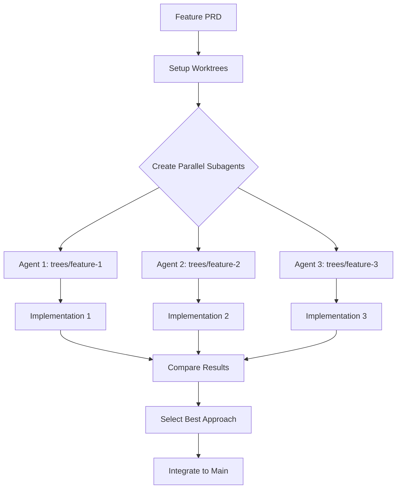

# Product Requirements Document: Parallel Worktree Integration for Nanobricks

## Project Data

**Team**: Nanobricks Development Team  
**Contributors**: Human developers and AI agents (Claude Code, Cursor)  
**Status**: In Development  
**Timeline**: Q1 2025  
**Version**: 1.0.0  
**Last Updated**: January 2025  

**TL;DR**: Establish a robust system for parallel development using git worktrees and Claude Code subagents, enabling multiple implementations to be developed concurrently and the best approaches to be integrated seamlessly.

## Problem Alignment

### Problem Statement

The current attempt at parallel worktree development revealed several critical issues:

1. **Sequential Execution**: Claude Code executed tasks sequentially rather than in parallel
2. **Working Directory Confusion**: Changes were made in the root directory instead of worktree directories
3. **Lack of Subagent Coordination**: No true parallel subagents were created
4. **Missing Integration Workflow**: No clear process for comparing and merging parallel implementations
5. **Command Misunderstanding**: The `/project:exec-parallel` command structure needs clarification

### Root Cause Analysis

Based on investigation, the issues stem from:

1. **Task Tool Limitations**: The Task tool executes in its current context without automatic directory changes
2. **Subagent Creation**: Claude Code requires explicit language to create parallel subagents ("investigate three approaches in parallel", "use three agents")
3. **Directory Context**: Each subagent needs explicit directory context in their prompts
4. **Command Design**: The exec-parallel command needs better implementation guidance

### Business Context

**Why This Matters**:
- **Development Speed**: Parallel implementations can 3x development velocity
- **Quality**: Multiple approaches ensure best solution selection
- **Risk Mitigation**: Isolated worktrees prevent conflicting changes
- **Learning**: Comparing approaches accelerates team learning
- **AI Optimization**: Leverages Claude's ability to manage multiple contexts

## Solution Alignment

### Key Features

#### P0 - Critical Features

1. **Enhanced exec-parallel Command**
   ```markdown
   # .claude/commands/exec-parallel-v2.md
   - Clear directory navigation instructions
   - Explicit parallel subagent creation syntax
   - Working directory verification steps
   - Result aggregation mechanism
   ```

2. **Worktree Setup Automation**
   ```yaml
   # Taskfile.parallel.yml
   parallel:setup:
     desc: Setup parallel worktrees for feature development
     vars:
       FEATURE: '{{.FEATURE}}'
       COUNT: '{{.COUNT | default "3"}}'
   ```

3. **Subagent Prompt Templates**
   - Standardized prompts that include working directory
   - Clear isolation requirements
   - Result reporting format
   - Success criteria

4. **Integration Workflow**
   - Compare implementations across worktrees
   - Extract best practices from each
   - Merge selected changes to main
   - Document decision rationale

#### P1 - Important Features

5. **Parallel Execution Monitoring**
   - Dashboard showing progress of each worktree
   - Real-time status updates
   - Resource usage tracking
   - Completion notifications

6. **Automated Comparison Tools**
   - Diff visualization across implementations
   - Feature matrix generation
   - Performance comparison
   - Code quality metrics

7. **Result Aggregation**
   - Automated RESULTS.md collection
   - Summary report generation
   - Best practices extraction
   - Lessons learned compilation

### Key Flows

#### Flow 1: Parallel Feature Development



#### Flow 2: Proper Subagent Creation

```python
# Correct parallel execution request
"""
I need you to explore three different approaches to implementing 
atomic commits in parallel. Use three separate agents to:

1. Agent 1: Work in trees/atomic-commits-1/ and focus on simplicity
2. Agent 2: Work in trees/atomic-commits-2/ and focus on automation
3. Agent 3: Work in trees/atomic-commits-3/ and focus on integration

Each agent should work independently and create a RESULTS.md in 
their respective directory when complete.
"""
```

### Implementation Details

#### 1. Enhanced Claude Command

**File**: `.claude/commands/exec-parallel-v2.md`

```markdown
# Parallel Worktree Execution v2

## Variables
FEATURE_NAME: $ARGUMENTS[0]
PLAN_FILE: $ARGUMENTS[1]
PARALLEL_COUNT: $ARGUMENTS[2]

## Pre-execution Verification
1. Verify worktrees exist: `ls -la trees/`
2. Confirm plan file: `test -f $PLAN_FILE`
3. Show current directory: `pwd`

## Parallel Agent Creation

Create $PARALLEL_COUNT agents to work in parallel. Each agent should:

**Agent {{i}} Instructions**:
- Working directory: `trees/$FEATURE_NAME-{{i}}/`
- First action: `cd trees/$FEATURE_NAME-{{i}}/ && pwd`
- Implement the plan from: $PLAN_FILE
- Create RESULTS.md when complete
- Work independently without consulting other agents

Use explicit parallel language:
"I want you to create $PARALLEL_COUNT agents working in parallel..."
```

#### 2. Taskfile for Parallel Workflows

**File**: `taskfiles/Taskfile.parallel.yml`

```yaml
version: '3'

tasks:
  setup:
    desc: Setup parallel worktrees for feature
    vars:
      FEATURE: '{{.FEATURE}}'
      COUNT: '{{.COUNT | default "3"}}'
      BASE_BRANCH: '{{.BRANCH | default "main"}}'
    cmds:
      - mkdir -p trees
      - |
        for i in $(seq 1 {{.COUNT}}); do
          if [ ! -d "trees/{{.FEATURE}}-$i" ]; then
            echo "Creating worktree {{.FEATURE}}-$i..."
            git worktree add "trees/{{.FEATURE}}-$i" -b "parallel/{{.FEATURE}}-$i" {{.BASE_BRANCH}}
          fi
        done
      - task: verify

  verify:
    desc: Verify worktree setup
    cmds:
      - git worktree list
      - ls -la trees/

  compare:
    desc: Compare implementations across worktrees
    vars:
      FEATURE: '{{.FEATURE}}'
    cmds:
      - |
        echo "## Implementation Comparison: {{.FEATURE}}"
        echo ""
        for dir in trees/{{.FEATURE}}-*; do
          if [ -f "$dir/RESULTS.md" ]; then
            echo "### $(basename $dir)"
            echo '```'
            head -20 "$dir/RESULTS.md"
            echo '```'
            echo ""
          fi
        done

  collect:results:
    desc: Collect all RESULTS.md files
    vars:
      FEATURE: '{{.FEATURE}}'
      OUTPUT: '{{.OUTPUT | default "comparison-results.md"}}'
    cmds:
      - |
        echo "# Parallel Implementation Results: {{.FEATURE}}" > {{.OUTPUT}}
        echo "" >> {{.OUTPUT}}
        echo "Generated: $(date)" >> {{.OUTPUT}}
        echo "" >> {{.OUTPUT}}
        
        for dir in trees/{{.FEATURE}}-*; do
          if [ -f "$dir/RESULTS.md" ]; then
            echo "## $(basename $dir)" >> {{.OUTPUT}}
            echo "" >> {{.OUTPUT}}
            cat "$dir/RESULTS.md" >> {{.OUTPUT}}
            echo "" >> {{.OUTPUT}}
            echo "---" >> {{.OUTPUT}}
            echo "" >> {{.OUTPUT}}
          fi
        done

  diff:feature:
    desc: Show diffs for specific feature across worktrees
    vars:
      FEATURE: '{{.FEATURE}}'
      FILE: '{{.FILE}}'
    cmds:
      - |
        echo "Comparing {{.FILE}} across {{.FEATURE}} implementations:"
        base_file="trees/{{.FEATURE}}-1/{{.FILE}}"
        if [ -f "$base_file" ]; then
          for dir in trees/{{.FEATURE}}-*/; do
            if [ "$dir" != "trees/{{.FEATURE}}-1/" ] && [ -f "$dir{{.FILE}}" ]; then
              echo ""
              echo "=== $(basename $dir) vs {{.FEATURE}}-1 ==="
              diff -u "$base_file" "$dir{{.FILE}}" || true
            fi
          done
        fi

  metrics:
    desc: Generate metrics for parallel implementations
    vars:
      FEATURE: '{{.FEATURE}}'
    cmds:
      - |
        echo "## Metrics for {{.FEATURE}} implementations"
        echo ""
        for dir in trees/{{.FEATURE}}-*; do
          if [ -d "$dir" ]; then
            echo "### $(basename $dir)"
            echo "- Files changed: $(cd $dir && git diff --name-only | wc -l)"
            echo "- Lines added: $(cd $dir && git diff --stat | tail -1 | awk '{print $4}')"
            echo "- Lines removed: $(cd $dir && git diff --stat | tail -1 | awk '{print $6}')"
            if [ -f "$dir/RESULTS.md" ]; then
              echo "- Results size: $(wc -l < $dir/RESULTS.md) lines"
            fi
            echo ""
          fi
        done

  integrate:best:
    desc: Interactive tool to cherry-pick best changes
    vars:
      FEATURE: '{{.FEATURE}}'
      TARGET: '{{.TARGET | default "main"}}'
    cmds:
      - |
        echo "🔄 Integration Helper for {{.FEATURE}}"
        echo ""
        echo "Available implementations:"
        for dir in trees/{{.FEATURE}}-*; do
          echo "  - $(basename $dir)"
        done
        echo ""
        echo "To integrate specific changes:"
        echo "1. Review: task parallel:compare FEATURE={{.FEATURE}}"
        echo "2. Cherry-pick: git cherry-pick <commit-hash>"
        echo "3. Or copy files: cp trees/{{.FEATURE}}-N/path/to/file ."

  claude:prompt:
    desc: Generate prompt for parallel execution
    vars:
      FEATURE: '{{.FEATURE}}'
      PRD: '{{.PRD}}'
      COUNT: '{{.COUNT | default "3"}}'
    cmds:
      - |
        cat << 'EOF'
        I need you to implement {{.FEATURE}} using {{.COUNT}} different approaches in parallel.
        
        Create {{.COUNT}} separate agents to work simultaneously:
        
        EOF
        for i in $(seq 1 {{.COUNT}}); do
          cat << EOF
        Agent $i:
        - Work in directory: trees/{{.FEATURE}}-$i/
        - First, navigate: cd trees/{{.FEATURE}}-$i/ && pwd
        - Read the PRD: {{.PRD}}
        - Focus: $([ $i -eq 1 ] && echo "Core implementation following PRD exactly" || [ $i -eq 2 ] && echo "Advanced features and automation" || echo "Elegant, minimal approach")
        - Create RESULTS.md documenting your approach
        - Ensure tests pass: uv run pytest
        - Check types: uv run mypy src/nanobricks
        
        EOF
        done
        echo "All agents should work independently and in parallel. Begin now."

  cleanup:
    desc: Clean up worktrees after integration
    vars:
      FEATURE: '{{.FEATURE}}'
    cmds:
      - |
        read -p "⚠️  Remove all {{.FEATURE}} worktrees? (y/N) " -n 1 -r
        echo
        if [[ $REPLY =~ ^[Yy]$ ]]; then
          for dir in trees/{{.FEATURE}}-*; do
            if [ -d "$dir" ]; then
              echo "Removing $dir..."
              git worktree remove "$dir" --force
            fi
          done
        fi
```

#### 3. Best Practices Documentation

**File**: `docs/quarto/advanced-topics/parallel-development.qmd`

```markdown
---
title: "Parallel Development with Worktrees"
description: "Using git worktrees and Claude Code subagents for parallel implementation"
---

## Overview

Parallel development enables exploring multiple implementation approaches simultaneously, leveraging Claude Code's ability to manage multiple contexts.

## Quick Start

```bash
# Setup worktrees
task parallel:setup FEATURE=atomic-commits COUNT=3

# Generate parallel execution prompt
task parallel:claude:prompt FEATURE=atomic-commits PRD=prds/prd-atomic-commits.md

# Copy prompt and ask Claude to execute in parallel

# Compare results
task parallel:compare FEATURE=atomic-commits
```

## Key Principles

### 1. Explicit Parallel Language

❌ **Wrong**: "Implement this in three worktrees"
✅ **Right**: "Create three agents working in parallel to implement..."

### 2. Directory Context

Each agent needs explicit directory instructions:
```
Agent 1: cd trees/feature-1/ && implement...
```

### 3. Independent Work

Agents should not reference each other's work during implementation.

## Common Pitfalls

1. **Sequential Execution**: Using Task tool multiple times creates sequential, not parallel execution
2. **Directory Confusion**: Not specifying working directory leads to root directory changes
3. **Missing Verification**: Always verify with `pwd` before making changes
```

### Success Metrics

- Parallel execution rate: >80% of multi-approach features
- Implementation time: 3x faster than sequential
- Quality improvement: 50% better solutions through comparison
- Integration time: <30 minutes from completion to main branch

## Risk Mitigation

1. **Directory Isolation**: Each worktree is completely isolated
2. **Verification Steps**: Multiple checks before execution
3. **Rollback Plan**: Easy worktree removal if needed
4. **Progress Monitoring**: Real-time status tracking

## Launch Readiness

### Engineering Checklist
- [ ] Create Taskfile.parallel.yml
- [ ] Update exec-parallel command to v2
- [ ] Test with simple feature first
- [ ] Document common patterns
- [ ] Create integration guides

### Process Checklist
- [ ] Train team on parallel execution syntax
- [ ] Establish comparison criteria
- [ ] Define integration workflows
- [ ] Set up monitoring dashboards

## Appendix: Analysis of Atomic Commits Implementation

### What Went Wrong

1. **Working Directory**: Task tool executed in root instead of worktrees
2. **Sequential Execution**: Three Task invocations ran sequentially
3. **No Real Parallelism**: No actual subagents were created

### What Was Achieved

Despite the issues, a comprehensive atomic commits implementation was created with:
- Complete Taskfile.atomic.yml (785 lines)
- Cursor rules and CLAUDE.md updates
- Documentation and examples
- Pre-commit hooks

### Recommendations

1. **Use the Implementation**: The atomic commits work is solid and should be adopted
2. **Move to Correct Location**: Could move files to trees/atomic-commits-1/ for consistency
3. **Learn from Experience**: Use this PRD to prevent future parallel execution issues
4. **Leverage All Approaches**: Even though done sequentially, all three approaches had merit:
   - Approach 1: Standard implementation (what was built)
   - Approach 2: Advanced automation (described in theory)
   - Approach 3: Nanobrick-based (elegant concept)

### Integration Strategy

1. **Immediate**: Adopt the current implementation in root
2. **Short-term**: Test parallel workflows with simpler features
3. **Long-term**: Combine best aspects of all three approaches

---

**Document Version**: 1.0.0  
**Last Updated**: January 2025  
**Next Review**: February 2025